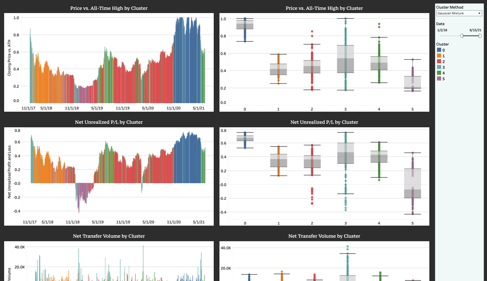

TokenSense is a web application that tracks the pulse of the Bitcoin community. It leverages a variety of price information, activity metrics, and sentiment metrics to provide actionable insights into the general sentiment of buyers and sellers of Bitcoin. TokenSense employs clustering techniques to group historical dates by their different levels of sentiment and activity. Has the market been overheated lately? Is it flatlining? TokenSense can provide a clearer picture, and it can also zoom in. Using topic modeling and sentiment analysis, TokenSense calculates and visualizes the prevalance and sentiment of news article topics across time. 

[Visit TokenSense by clicking here](https://share.streamlit.io/drwismer/metis_unsupervised_learning_module/main/tokensense.py) and be sure to use the dropdown menu to find what you need. Keep on the crypto pulse.

This project was built as part of the Natural Language Processing (NLP) and Unsupervised Learning module during the Metis Data Science Bootcamp. For a full write-up on this project, please [click here](https://github.com/drwismer/metis_unsupervised_learning_module/blob/main/writeups/project_writeup_tokensense.md) or navigate to the "writeups" folder in this repository.

This was my process. Visit the linked Jupyter notebooks for details:

**Data Gathering**
- [Web Scraping](https://github.com/drwismer/metis_unsupervised_learning_module/blob/main/Bitcoin%20Sentiment%20-%20Web%20Scraping%20-%20Articles.ipynb) - I scraped over 60,000 from four different Bitcoin related news websites. Only 19,000 of these were used in topic modeling and sentiment analysis due to a sparcity of data for earlier dates. The articles range from January 2017 through June 2021.
- [Google and Reddit Data](https://github.com/drwismer/metis_unsupervised_learning_module/blob/main/update_db_sentiment.ipynb) - This project also included Google trends data and Reddit comments, both the actual text and some associated metadata. I used PyTrends and PRAW to collect this data.
- [Financial Data](https://github.com/drwismer/metis_unsupervised_learning_module/blob/main/update_db_financial.ipynb) - I also included financial data, specifically price and volume information and on-chain metrics. Price and volume information was obtained using jesse.trade and on-chain metrics were obtained using the Glassnode API. Note that Glassnode requires a subscription.

**Exploratory Data Analysis (EDA)**
- [Google and Reddit EDA](https://github.com/drwismer/metis_unsupervised_learning_module/blob/main/Bitcoin%20Sentiment%20-%20EDA%20-%20Google%20and%20Reddit.ipynb) - The primary EDA performed here was looking for dates with missing information and understanding how to handle parabolic moves. I engineered some features comparing, for example, Google activity versus its to-date all-time high. Even with this adjustment, the graph appeared parabolic, which is not ideal for clustering algorithms. In the case of Google activity, I instead engineered a "daily activity vs. prior all-time median" feature. See the notebook for details.
- [News Article EDA](https://github.com/drwismer/metis_unsupervised_learning_module/blob/main/Bitcoin%20Sentiment%20-%20EDA%20-%20Articles.ipynb) - I removed articles that were small (less than 200 words) or did not relate substantially to Bitcoin. See the notebook for details.

**Topic Modeling and Clustering**
- [Topic Modeling](https://github.com/drwismer/metis_unsupervised_learning_module/blob/main/Bitcoin%20Sentiment%20-%20Topic%20Modeling%20-%20Articles.ipynb) - I primarily leveraged the Gensim library to generate 25 unique topics from the Bitcoin news articles. The pyLDAvis visualization is not shown in the notebook, but if you visit the web application, you can find the pyLDAvis in the final dashboard in the dropdown menu.
- [PCA and Clustering - Articles](https://github.com/drwismer/metis_unsupervised_learning_module/blob/main/Bitcoin%20Sentiment%20-%20PCA%20and%20Clustering%20-%20Article%20Topics.ipynb) - I attempted some clustering of topics to fewer dimensions, but the results were less interpretable. In this notebook, the most interesting information is the TextBlob sentiment analysis by topic toward the bottom of the notebook. I recommend visiting the web application to more easily dig into how topic sentiment and prevalance changed over the time period of my data.
- [PCA and Clustering - Daily Sentiment](https://github.com/drwismer/metis_unsupervised_learning_module/blob/main/Bitcoin%20Sentiment%20-%20PCA%20and%20Clustering%20-%20Sentiment.ipynb) - I used the sentiment scores (polarity, subjectivity) from Textblob, as well as price metrics, activity metrics (e.g. Google/Reddit activity), and on-chain metrics (e.g. NUPL, NTV, active addresses) to cluster historical dates into "daily sentiment clusters." I performed principal component analysis and tested several clustering methods (K-Means, Gaussian mixture, DBSCAN/HDBSCAN, HAC). You can see 3D PCA GIF's in my [project writeup](https://github.com/drwismer/metis_unsupervised_learning_module/blob/main/writeups/project_writeup_tokensense.md), and you can toggle between different clustering methodlogies in the web application or at the embedded [Tableau public dashboard](https://public.tableau.com/app/profile/david.wismer/viz/TokenSense-BitcoinSentimentAnalysis/SentimentClusters).

**Production**
- [Tableau Public](https://public.tableau.com/app/profile/david.wismer/viz/TokenSense-BitcoinSentimentAnalysis/)
- [Streamlit App](https://share.streamlit.io/drwismer/metis_unsupervised_learning_module/main/tokensense.py)

  

## Dashboard Images

[Link to Dashboard](https://public.tableau.com/app/profile/david.wismer/viz/TokenSense-BitcoinSentimentAnalysis/TopicPrevalenceandSentiment)

[Link to Dashboard](https://public.tableau.com/app/profile/david.wismer/viz/TokenSense-BitcoinSentimentAnalysis/TopicDeepDive)

[Link to Dashboard](https://public.tableau.com/app/profile/david.wismer/viz/TokenSense-BitcoinSentimentAnalysis/TopicPolarityandSubjectivity)

[Link to Dashboard](https://public.tableau.com/app/profile/david.wismer/viz/TokenSense-BitcoinSentimentAnalysis/SentimentClusters)

