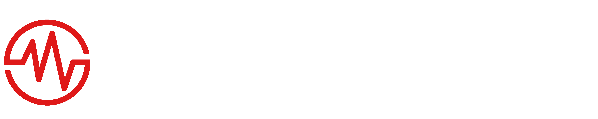
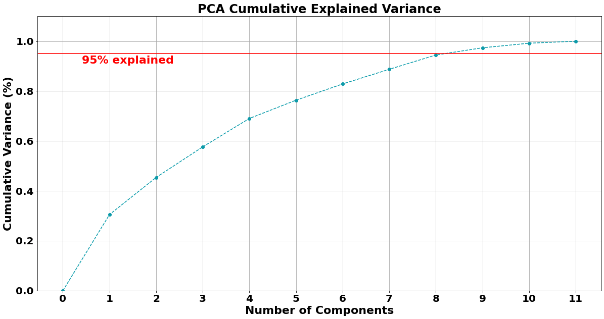
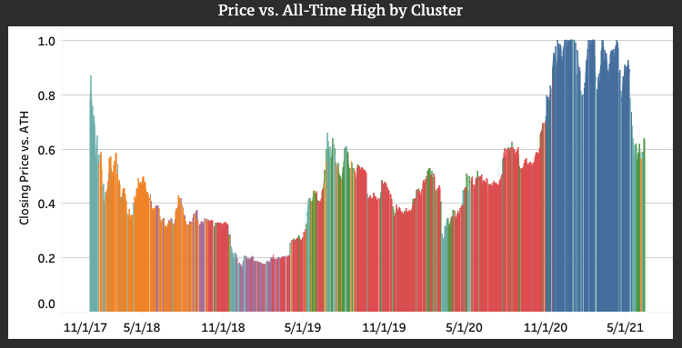
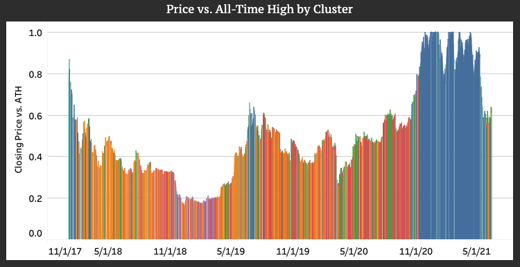
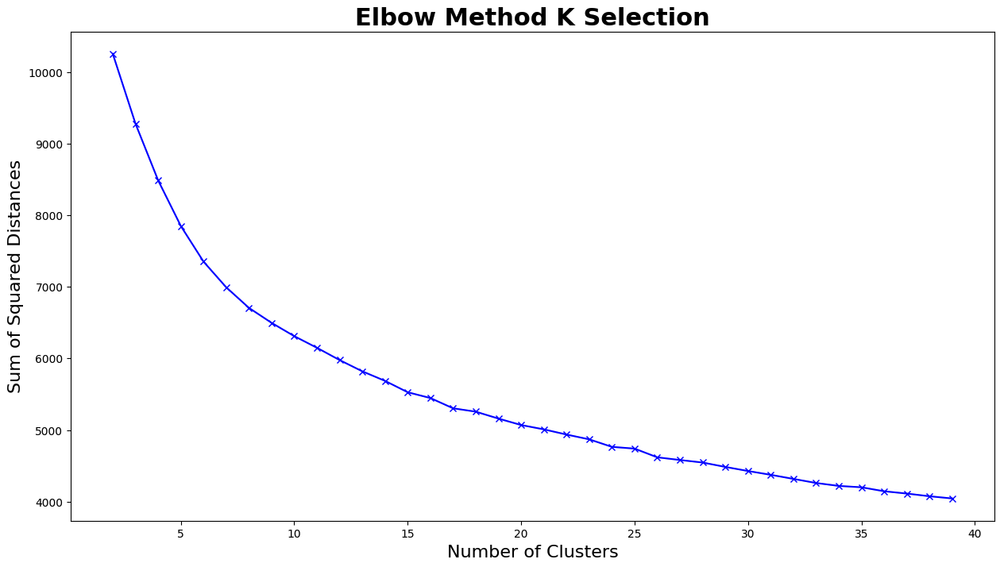
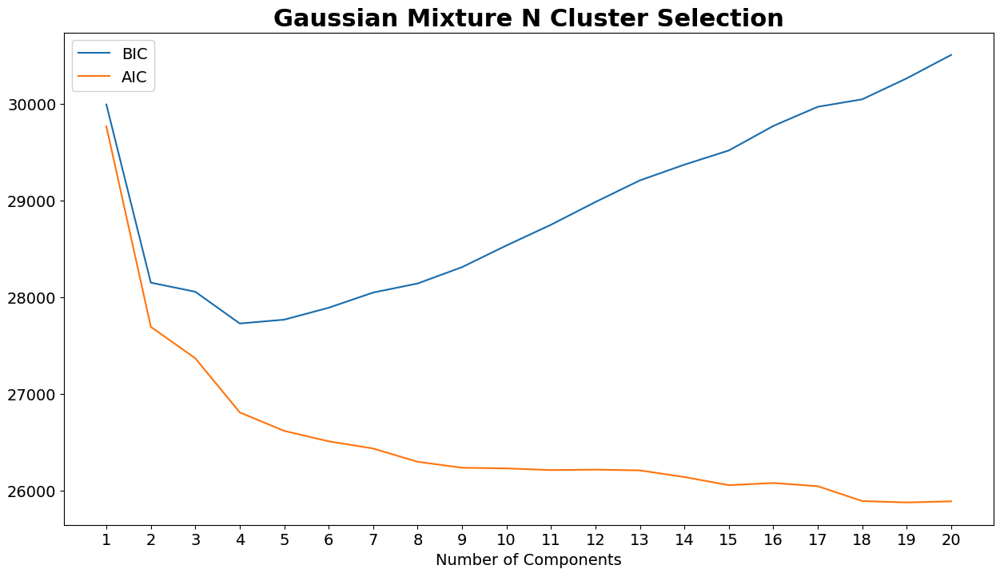
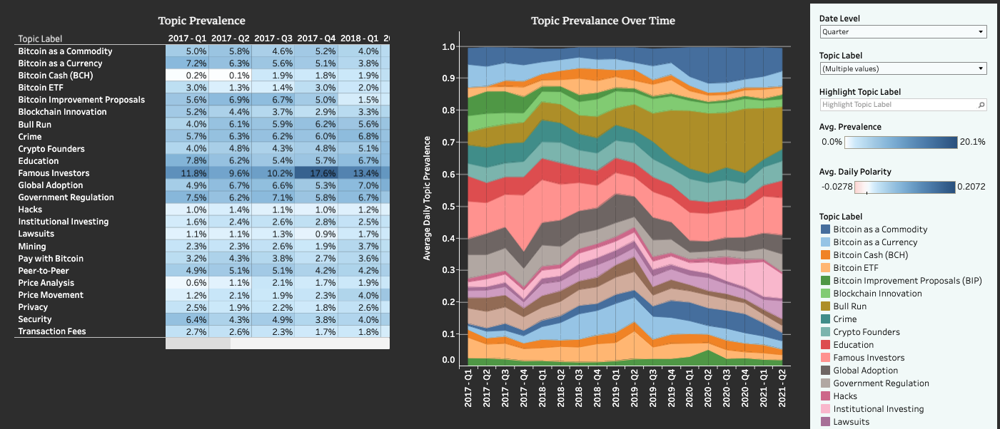
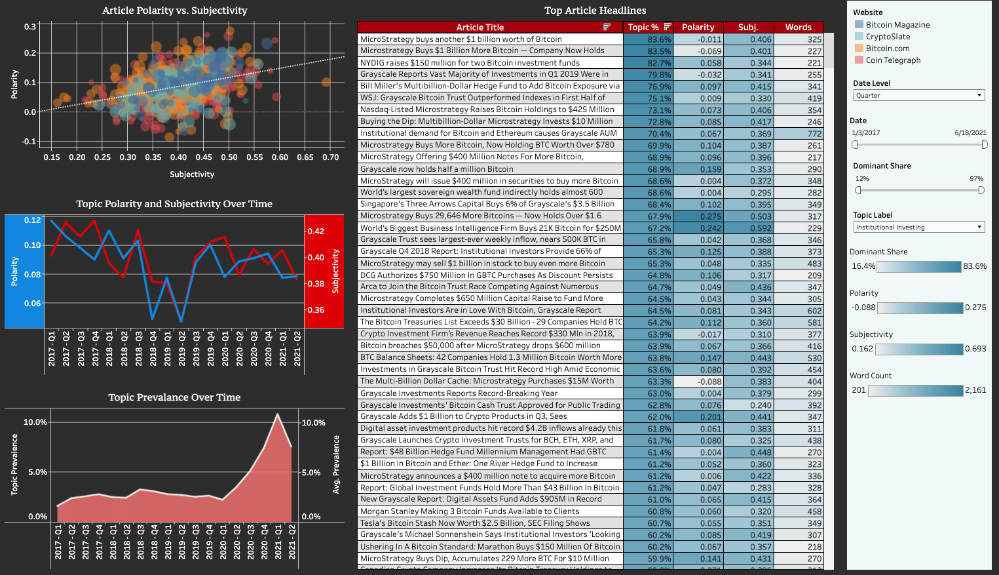
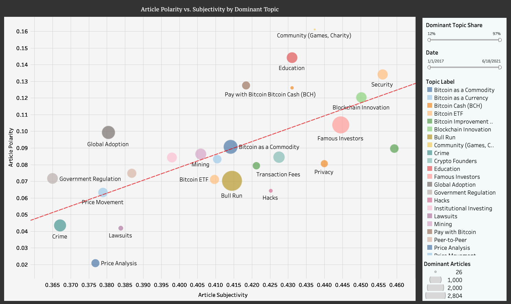

# Project Write-Up

## Abstract

TokenSense is a web application that tracks the pulse of the Bitcoin community. It leverages a variety of price information, activity metrics, and sentiment metrics to provide actionable insights into the general sentiment of buyers and sellers of Bitcoin. TokenSense employs clustering techniques to group historical dates by their different levels of sentiment and activity. Has the market been overheated lately? Is it flatlining? TokenSense can provide a clearer picture, and it can also zoom in. Using topic modeling and sentiment analysis, TokenSense calculates and visualizes the prevalance and sentiment of news article topics across time. 

[Visit TokenSense by clicking here](https://share.streamlit.io/drwismer/metis_unsupervised_learning_module/main/tokensense.py) and be sure to use the dropdown menu to find what you need. Keep on the crypto pulse.

## Design

This project was designed, in part, to provide a picture of general sentiment in the Bitcoin community as of a chosen point in time. It also aims to provide historical context that allows the user to dig into past trends and draw conclusions about what may happen in the future. To achieve this, I set out to build two primary functionalities:

#### **1. Sentiment Clusters by Date**

Dates were clustered using three types of metrics:  price level metrics, activity metrics, and sentiment metrics. These metrics make for a [very useful dashboard](https://share.streamlit.io/drwismer/metis_unsupervised_learning_module/main/tokensense.py) that can compare a given date against a historical distribution of price, activity, and sentiment. By clustering dates based on where current price sits versus all-time highs, the activity level of the Bitcoin market  and community, and sentiment levels, we can tell when the Bitcoin community is feeling dejected, euphoric, or somewhere in-between. By studying the trends in past clusters, we may be able to make more educated guesses about future price movements. 

Clustering metrics for this project include:
- **\[Price Level\]** Bitcoin Price vs. Prior All-Time High - When prices reach new all-time highs, the market gets excited about how high it can go. During steep drawdowns, the market becomes fearful. 
- **\[Price Level\]** Net Unrealized Profit or Loss (NUPL) - NUPL is a traditional measure of sentiment that reflects the percentage of people who own Bitcoin that are currently in the money.
- **\[Activity Level\]** Net Transfer Volume (NTV) - NTV is a measure of whether Bitcoin is flowing from storage (e.g. hardware wallets) into exchanges or vice versa. The theory is that Bitcoin tends to flow into exchanges prior to sell offs and out of exchanges when investors intend to hold Bitcoin longer term.
- **\[Activity Level\]** Active Addresses vs. All-Time High - This measure reflects the number of addresses involved in transactions versus previous peaks.
- **\[Activity Level\]** Google Activity - This reflects Google trends data.
- **\[Activity Level\]** Reddit Activity vs. Prior All-Time High - There is a daily discussion thread on the Bitcoin subreddit. This measure reflects how many comments are made on the daily thread for each date.
- **\[Sentiment\]** Reddit Polarity - This measure reflects the average positive/negative sentiment of comments for a given date.
- **\[Sentiment\]** Reddit Subjectivity - This measure reflects the average opinionated-ness of comments for a given date.
- **\[Sentiment\]** News Article Polarity - This measure reflects the average positive/negative sentiment of news articles for a given date.
- **\[Sentiment\]** News Article Subjectivity - This measure reflects the average opinionated-ness of news articles for a given date.

#### **2. Topic Modeling, Prevalence and Sentiment**

News articles from January 2017 through June 2021 were clustered into a variety of cohesive topics. Article topic distributions were used to generate average topic distributions by date, which allows for tracking the [prevalance of topics over time](https://public.tableau.com/app/profile/david.wismer/viz/TokenSense-BitcoinSentimentAnalysis/TopicPrevalenceandSentiment). In addition to seeing which topics rise and fall in terms of popularity, it is also possible to generate sentiment analysis on a topic by topic basis by assigning a dominant topic to each article based on its topic distribution. By averaging across articles, we can see the movement of a topic's [polarity and subjectivity over time](https://public.tableau.com/app/profile/david.wismer/viz/TokenSense-BitcoinSentimentAnalysis/TopicDeepDive).

## Data

This projected required substantial text data in order view how topics and sentiment analysis change over time. In addition to text data, I also needed to obtain activity and price related information for the same time period. The data I obtained is detailed below.

#### **Text Data:**
- 60,000 News Articles (19,000 used in topic modeling) - I built four separate web scrapers using a combination of Selenium and Beautiful Soup. I scraped four websites for new articles:  Bitcoin.com, BitcoinMagazine.com, CoinTelegraph.com, and CryptoSlate.com. The articles obtained dated back to 2013, but the articles were too sparse prior to 2017. For topic modeling, I excluded all articles with publish dates prior to January 1, 2017.
- 115,000 Reddit Comments - Using the PRAW library and the Reddit API, I obtained text data for the top 100 comments from each Daily Discussion Thread in the r/Bitcoin subreddit from January 2018 through June 2021.

#### **Activity Data:**
- Reddit Activity - In addition to text data, I obtained the total number of comments for each Daily Discussion Thread as a proxy for Reddit activity.
- Google Activity - I used the PyTrends library to obtain Google activity for the "bitcoin" keyword from January 2015 through June 2018.
- Active Addresses - Obtained from Glassnode.com using the Glassnode API.

#### **On-Chain Metrics:**
- Net Unrealized Profit and Loss (NUPL) - Obtained from Glassnode.com using the Glassnode API.
- Net Transfer Volume (NTV) - Obtained from Glassnode.com using the Glassnode API.

#### **Feature Engineering and Data Transformations:**
- Comparison to All-Time Highs - For many features, particularly price and activity features, the prior peaks tend to be parabolic. It was beneficial to convert such metrics from their raw form to a comparison against the prior all-time high. This was done for Price, Active Addresses, and Reddit Activity.
- Daily Sentiment Metrics - TextBlob was used to generate polarity and subjectivity metrics for each Reddit comment and news article in my database. I used the document specific sentiment to calculate daily average polarity and subjectivity for Reddit and news articles, both of which were used in the clustering exercise.
- Standard Scaling - All data was scaled using StandardScaler from the Sci-kit Learn library.

## Algorithms

#### Principal Component Analysis and Clustering Methods

After feature engineering and standard scaling my data, the next step was to perform Principal Component Analysis in order to reduce features and visualize different clustering methodologies. I was comfortable reducing the components to a level at which 95% of my variance was still explained. This is a common threshold for PCA. In doing PCA, I was able to reduce from 11 components to 8 components while still meeting the 95% threshold, as shown below.

After selecting 8 principal components, I applied PCA to my standard scaled data and tested out a variety of different clustering methods:  K-Means, Gaussian Mixture, DBSCAN, HDBSCAN, Mean-Shift, and Hierarchical Agglomerative Clustering (HAC). The density-based algorithms, even with parameter tuning, did not return reasonable clusters, as many of my features are concentrated fairly densely around the mean. K-Means, HAC, and Gaussian Mixture methods returned more reasonable clusters. Gaussian Mixture stood out, as it is able to pick out more oblong shapes that K-Means and HAC. As my project focuses on time-series data, it makes sense that some of these oblong shapes can form, as features may, at times, trend slowly over the course of days, weeks, or months. Below, you'll first see figures showing PCA for 3 components. HDBSCAN struggled with the varying density of clusters, and Gaussian Mixture clusters have more oblong shapes than K-Means and HAC. Below the PCA figures, you'll also see a comparison of K-Means and Gaussian Mixture clusters by date, shown on a Price vs. All-Time High area plot. This plot shows how the Gaussian Mixture method lumped days and weeks together much more so than K-Means. More analysis would be required to determine if one particular clustering method has more value (i.e. predictive power) than another. Both are available for viewing in my [Tableau dashboard](https://public.tableau.com/app/profile/david.wismer/viz/TokenSense-BitcoinSentimentAnalysis/SentimentClusters), as is HAC.

K-Means             |  Gaussian Mixture
:-------------------------:|:-------------------------:
 |  

HDBSCAN             |  Hierarchichal Agglomerative
:-------------------------:|:-------------------------:
 |  

  

**K-Means Clustering - 6 Clusters**

**Gaussian Mixture Clustering - 6 Clusters**

#### Selecting the Number of Clusters

**K-Means**

I employed both the elbow method and review of silhouette scores to help determine the optimal number of K-Means clusters. In both cases, somewhere between 6 and 9 clusters seemed reasonable. See below for an elbow plot. The elbow appears to occur from around 6-9 clusters. Silhouette scores peak at just 2 clusters (0.26) and range very closely from 3 clusters (0.147) to 10 clusters (0.133), before dropping off. Ultimately, I decided to use just 6 clusters, as the performance scores were near the top and adding any more clusters made for more difficult interpretation.

**Gaussan Mixture**

For the Gaussian Mixture method, I plotted Bayesian Information Criterion (BIC) and Akaike Information Criterion (AIC) to help determine the optimal number of clusters. For both BIC and AIC, this method involves choosing the number of clusters that provides the minimum value. As shown in the plot below, BIC reaches a local minimum at 4 clusters. AIC does not approach a minimum at a reasonable number of clusters, but the elbow is somewhere around 4-6 clusters. For consistency across clustering methodologies, I selected 6 clusters for Gaussian Mixture as well. 

#### Topic Modeling

My ultimate goal for topic modeling was to generate clearly unique topics from news articles related to Bitcoin and track the topic distribution (or prevalence) and topic sentiment over time. I decided to use the **Latent Dirichlet Allocation Model** from the Gensim library. The Gensim LDA Model returns topic distributions for each article, as well as term distributions within the topics, which allowed for very interesting visualizations that can help a user deep dive into individual topics. My topic modeling process went as follows:

1. **Remove noise in the data.** First, I needed to get rid of extraneous text in the articles. This included sentences like disclaimers, image credits, or recommendations for other articles. Next, I excluded articles that were too short or did not relate to Bitcoin. I removed all articles with 200 words or less (as determined using a NLTK tokenizer). I also removed any articles when BOTH the title did not contain "Bitcoin" or "BTC" AND the word count in the body of the article was 1% or less made up of "Bitcoin" or "BTC." I also dropped articles where "Bitcoin" and "BTC" made up less than 0.5% of the word count, even when the title included "Bitcoin" or "BTC". Finally, due to sparse data, I excluded all data prior to 2017. After this cutoff, every single day in my time period had at least a few articles.
2. **Reshape the data for LDA modeling with Gensim.** 
    - Tokenize the articles.
    - Remove stopwords (loaded from NLTK).
    - Generate bigrams and trigrams.
    - Lemmatize the data. I only kept certain parts of speech: nouns, adjectives, verbs, and adverbs.
    - Create the dictionary (vocabulary) and corpus.
    - Filter out words appearing in 60% or more of articles and words appearing in 50 articles or less.
3. **LDA parameter tuning.** I built a custom function that mimics grid search in order to find the combination of parameters that maximized the ***coherence score*** and ideality minimized the ***perplexity score*** of my LDA model. Through parameter tuning, I was able to increase the coherence score from 0.472 with no tuning to 0.523 with tuning, nearly an 11% increase. Perplexity did not change significantly. More importantly, the topics produced by the optimal model were fairly easily distinguishable. Listed below are the parameters included in the grid search and the optimal values:
    - num_topics:      25
    - decay:           0.5
    - per_word_topics: True
    - update_every:    1
    - alpha:           'asymmetric'
    - chunksize:       1500
    - passes:          10
    - iterations:      200
4. **Article topic tagging.** After creating the topics, I created a matrix of the topic distributions for each article. I then calculated the dominant topic and the dominant topic share percentage for each article. This matrix was the key input to tracking sentiment for topics across time.
5. **Calculate daily prevalence.** Because I had determined the topic distribution for each article in my database, I was able to average the articles for each date in my time period to determine the topic distribution for any given day. In a [Tableau dashboard](https://public.tableau.com/app/profile/david.wismer/viz/TokenSense-BitcoinSentimentAnalysis/TopicPrevalenceandSentiment), I was then able to visualize how the distribution of topics in the corpus changed over the time period of the data. A screenshot from the dashboard can be seen below.
6. **Label the topics.** The final step before populating the Tableau dashboards was to create reasonable labels for each of my 25 topics. These range from "Bitcoin ETF" to "Government Regulation" to "Blockchain Innovation." Some of the topics, while distinguishable, are somewhat related. For example, "Crimes," "Hacks," and "Lawsuits" all have common themes. I included functionality in one [Tableau dashboard](https://public.tableau.com/app/profile/david.wismer/viz/TokenSense-BitcoinSentimentAnalysis/TopicDeepDive) that allows for tracking the sentiment and prevalence of a ***combination of topics***.
7. **Visualize topic sentiment over time.** As part of the clustering exercise I had already completed, I had polarity and subjectivity scores for each article. After topic modeling, I had the dominant topics for each of the articles. In Tableau, I was then able to create a handful of useful visualizations to show the trending of topic sentiment. Some of these are pictured below.

#### Visualizations

[Link to Dashboard](https://public.tableau.com/app/profile/david.wismer/viz/TokenSense-BitcoinSentimentAnalysis/TopicPrevalenceandSentiment)

[Link to Dashboard](https://public.tableau.com/app/profile/david.wismer/viz/TokenSense-BitcoinSentimentAnalysis/TopicDeepDive)

[Link to Dashboard](https://public.tableau.com/app/profile/david.wismer/viz/TokenSense-BitcoinSentimentAnalysis/TopicPolarityandSubjectivity)

## Tools

**Data Gathering**
- Web Scraping:  Selenium, Beautiful Soup
- API's:  PRAW library (Reddit), PyTrends (Google), Glassnode API

**Data Storage**
- Database:  PostgreSQL
- Pickling:  Pickle library

**Text Processing**
- Preprocessing:  NLTK (stop words), Gensim, Spacy (en_core_web_sm model)
- LDA Topic Modeling:  Gensim
- Sentiment Analysis:  TextBlob

**Modeling**
- PCA:  Sci-kit Learn
- Clustering:  Sci-kit Learn (KMeans, DBSCAN, GaussianMixture), HDBSCAN (separate library

**Visualization**
- Jupyter Visualizations:  Matplotlib
- 3D GIF's:  Matplotlib + [Gif Maker](https://imgflip.com/gif-maker?from=images)
- LDA Visualizatiton:  pyLDAvis

**Production**
- Web App: Streamlit, Github
- Visualizations:  Tableau Public

## Communication

I developed a cohesive theme that persists across my [presentation slides](https://github.com/drwismer/metis_unsupervised_learning_module/blob/main/writeups/tokensense_slides.pdf) and my TokenSense [web application](https://share.streamlit.io/drwismer/metis_unsupervised_learning_module/main/tokensense.py). With TokenSense, I strived to tell stories with the data and empower the user to discover their own stores. Each dashboard serves its own purpose to help the user dig into interesting trends in the sentiment of the Bitcoin community.
